Oracle Label Security 실습 예제
=========

Oracle label Security(OLS) 데모 예제는 군사비밀관리 규정을 기반으로 한 가상의 시나리오를 토대로 DB 테이블에 저장된 비밀(중요)데이터에 대한 섬세한 접근통제 방법을 시뮬레이션 한 예제로서 가상의 조직과 가상의 데이터를 사용하여 OLS Policy를 통한 Row 데이터 통제방법을 담고 있습니다.

# 데모 및 실습 환경
* 오라클 DB 버전 : Oracle Enterprise Edition 19.3.0.0.0
* GUI tool : Enterprise Manager Cloud control 13c
- 이 데모 환경에서는 오라클 DBMS 19c, EMCC Install 과정은 생략합니다.
* 작성자 : 고운용
* 작성일 : 2020. 3월

# 환경 준비

## OLS 환경 확인 및 활성화
### LBACSYS 계정 활성화
OLS의 Master administrator의 계정은 LBACSYS이며 일반적인 sysdba 권한을 가진 sys(또는 system)와 별도로 권한이 분리 되어 있습니다. OLS Ploicy를 비롯한 관련 Dictionary 정보를 관리합니다. OLS를 처음 사용하는 DB 인스턴스에서는 Account Lock이 된 상태일 수 있습니다. 다음은 LABCSYS 계정을 활성화합니다.

```SQL
conn /as sysdba
alter user lbacsys identified by "password" account unlock;
```

### Oracle Label Security 활성화
```SQL
connect / as sa_sysdba

/* OLS가 활성화 되어 있는지 여부를 확인 합니다 */

SELECT VALUE FROM v$option WHERE parameter = 'Oracle Label Security';
Value
-----
FALSE

SELECT status FROM dba_ols_status WHERE name = 'OLS_CONFIGURE_STATUS';
STATU
-----
FALSE

/* OLS 활성화 */
EXEC LBACSYS.CONFIGURE_OLS;
EXEC LBACSYS.OLS_ENFORCEMENT.ENABLE_OLS;

/* 에러없이 실행 됐다면 이제 DB를 restart 합니다 */
shutdown IMMEDIATE;
startup;

show user
SELECT status FROM dba_ols_status WHERE name = 'OLS_CONFIGURE_STATUS';
STATU
-----
TRUE
SELECT VALUE FROM v$option WHERE parameter = 'Oracle Label Security';
VALUE
----------------------------------------------------------------
TRUE

/* OLS 활성화 작업이 끝 났습니다 */

```
이제 OLS를 사용할 수 있는 상태가 만들어졌습니다.

## 데모 유저 생성
* 데모 예제에서 사용할 DB 유저는 docadmin, docuser와 Profiled(Uxxxx\_nn) user를 사용합니다.
* Table owner인 docadmin은 비밀데이터가 저장되는 테이블의 소유자입니다. LBACSYS로 부터  Label Security adminintration 권한을 부여 받고 policy(doc_t_pol)에 대한 관리 권한을 가집니다.
* docuser는 Assumed user라고 할 예정이며 일명 Synonym 유저라고 할 수 있습니다. 데이터에 대한 아무 소유권도 없지만 "Profile_access" privilege를 부여 받아 이 유저를 통해서만 비밀데이터에 대한 접근을 허용하는데 사용됩니다.  
* Profiled user는 실제 어플리케이션 유저와 유사하며 이 데모에서는 비밀관리계정으로 사용됩니다. 이 계정에 세션 프로파일을 설정하여 비밀데이터가 저장된 테이블의 Row 데이터에 접근할 수 있습니다. (Profiled user는 오라클 용어는 아니며 데모 예제에서 이해를 위해 사용되는 용어입니다)

### Table owner 및 Assumed user 생성, 권한 설정
* docuser user는 테이블을 소유할 필요가 없기 때문에 별도의 테이블스페이스를 할당하지 않습니다.
* docadmin user는 policy에 대한 관리 권한을 위하여 "sa_policy_admin"과 관련한 package들을 실행할 수 있는 권한을 부여합니다.
* OLS policy가 적용된 컬럼에 Data Label 값은 10자리 10진수로 표시됩니다. 숫자화된 Label 값을 문자로 변화하거나 숫자값을 문자로 변환하는 함수에 대한 실행권한이 필요합니다.

```SQL
connect / as sysdba
create user docadmin identified by docadmin;
grant connect, resource to docadmin;
GRANT unlimited TABLESPACE TO docadmin;

create user docuser identified by docuser;
grant connect to docuser;

GRANT lbac_dba TO docadmin;   
GRANT EXECUTE ON sa_policy_admin TO docadmin;   
GRANT EXECUTE ON to_lbac_data_label TO docadmin;
GRANT EXECUTE on to_data_label to docadmin, docuser;
Grant EXECUTE on label_to_char to docadmin, docuser;
```

### Assumed user 생성
* Assumed user는 실제 DB 계정입니다. 실제 어플리케이션 환경에서는 사용자 관리를 위하여 LDAP을 사용하거나 또는 별도 어플리케이션에서 계정을 만들어 사용합니다. 이 계정을 통하여 다양한 업무기능에 액세스 할 수 있도록 관리를 합니다. 하지만 실제 DB 테이블에 액세스하는 DB 계정은 다양한 조건에 부합하게 구현되지 않는게 현실입니다. 바로 이 부분에서 보안 이슈가 발생하고 있고 어플리케이션 운영 효율성으로 인해 묵과되고 있습니다. 다양한 어플리케이션 사용자들을 테이블의 Row 데이터에 접근하는 것을 통제하기 위해서는 사용자를 명확하게 식별할 수 있어야 하며 이를 통한 접근통제를 해야 합니다. 이 때 사용할 수 있는 방법으로 오라클은 다양한 섬세한(Fine Grain) 통제 방법을 제공합니다. 이 데모에서는 사용자 별로 일명 Assumed user 계정을 개별로 사용하는 profile access 통제방법을 사용합니다.
* 기타 proxy user를 포함한 어플리케이션 친화적이면서 효율적인 통제 방법은 오라클 security에서 많은 방법을 제공합니다. 직접 Administrator 가이드를 참고하거나 오라클 Tech sales consuntant와 상의하십시오.
* Assumed user(비밀관리계정) 기본 정보

 |부대  | 부서  | 소속코드 |  업무권한  | 비밀취급인가수준| 비밀관리계정|
|------|----|----|----|----|-----|
|AFHQ|HQ |4000 | Manager |2급 |U4000_00|
|AFOC|HQ|4200|Manager|2급|U4200_00|
|AFOC|OP|4202|Manager|2급|U4202_00|
|AFOC|OP|4202|Member|2급|U4202_01|
|AFOC|OP|4202|Member|3급|U4202_02|
|AFOC|OP|4202|Member|비밀서약자|U4202_03|
|AFOC|LOC|4204|Manager|2급|U4204_00|
|AFOC|LOC|4204|Member|2급|U4204_01|
|AHQ|HQ|1000|Manager|2급|U1000_00|
|GOC|HQ|1200|Manager|2급|U1200_00|
|GOC|OP|1202|Manager|2급|U1202_00|
|GOC|OP|1202|Member|2급|U1202_01|
|GOC|ICT|1202|Manager|2급|U1205_00|
|GOC|ICT|1202|Member|3급|U1205_01|

* 비밀관리계정은 "Manager"는 '\_00'으로 사용하며, "Member"는 '\_01','\_02'로 사용합니다.
* '비밀취급인가수준'의 "2급", "3급"은 해당 비밀등급의 문서를 다룰 수 있는 것을 의미하며, "비밀서약자"는 비밀을 다룰 수는 없지만 "대외비" 문서를 조회 할 수 있는 사용자를 의미합니다.
* 이 데모에서 "소속코드는" OLS Policy(doc_t_policy)에서 그룹명으로 사용됩니다.
* Access Profiled User는 기본적으로 DB에 접근할 수 있는 privilege만 주고 테이블스페이스는 할당하지 않습니다.

```SQL
conn / as sysdba
create user U4000_00 identified by welcome1;
create user U4200_00 identified by welcome1;
create user U4202_00 identified by welcome1;
create user U4202_01 identified by welcome1;
create user U4202_02 identified by welcome1;
create user U4202_03 identified by welcome1;
create user U4204_00 identified by welcome1;
create user U4204_01 identified by welcome1;
create user U1000_00 identified by welcome1;
create user U1200_00 identified by welcome1;
create user U1202_00 identified by welcome1;
create user U1202_01 identified by welcome1;
create user U1205_00 identified by welcome1;
create user U1205_01 identified by welcome1;

grant conect to to U4000_00, U4200_00,U4202_00, U4202_01,U4202_02,U4202_03,U4204_00,U4204_01,U1000_00,U1200_00,U1202_00,U1202_01,U1205_00,U1205_01;
```

### 테이블 생성 및 권한 주기
* 데모에서 사용할 'doc_t_doc' 테이블을 만들고 관련 사용자 계정에 Access 권한을 부여합니다.

```SQL
conn docadmin/docadmin
Create table doc_t
(doc_no varchar2(10),
doc_creator varchar(20),
doc_type varchar2(10),
doc_state varchar2(10),
sign_org varchar2(20),
dist_target varchar2(3000),
content blob,
CONSTRAINT doc_no_pk Primary KEY(doc_no, doc_creator, doc_type));
grant select, update, delete, insert on doc_t to docuser;

- doc_type varchar2(10)  /* "2급","3급","대외비" */,
- doc_state varchar2(10) /*"결재","배부" */,
- sign_org varchar2(20)  /* 비밀문서 생산 부서 의미*/,
- dist_target varchar2(3000) /* 비밀문서 배부처를 의미하며 이 문서에 접근할 수 있는 부대를 의미합니다*/,

desc doc_t
 Name			 Null?	  Type
 ----------------------- -------- ----------------
 DOC_NO 		 NOT NULL VARCHAR2(10)
 DOC_CREATOR		 NOT NULL VARCHAR2(20)
 DOC_TYPE		 NOT NULL VARCHAR2(10)
 DOC_STATE			  VARCHAR2(10)
 SIGN_ORG			  VARCHAR2(20)
 DIST_TARGET			  VARCHAR2(3000)
 CONTENT			  BLOB
```
* 가상 데이터를 입력하여 데이터를 확인합니다.

```SQL
conn docadmin/docadmin
insert into docadmin.doc_t(doc_no,doc_creator,doc_type,doc_state, sign_org, content) values('20-0001','4202_01','2급','결재','AFOC_OP',UTL_RAW.CAST_TO_RAW('20-0001 문서는 2급 입니다'));
insert into docadmin.doc_t(doc_no,doc_creator,doc_type,doc_state, sign_org, content) values('20-0002','4202_01','3급','결재','AFOC_OP',UTL_RAW.CAST_TO_RAW('20-0002 문서는 3급 입니다'));
insert into docadmin.doc_t(doc_no,doc_creator,doc_type,doc_state, sign_org, content) values('20-0003','4202_02','대외비','결재','AFOC_OP',UTL_RAW.CAST_TO_RAW('20-0003 문서는 대외비 입니다'));

set line 200
col dist_target format a20
col content format a30

select doc_no,doc_creator,doc_type,doc_state, sign_org,dist_target, UTL_RAW.CAST_TO_VARCHAR2(content) as content from docadmin.doc_t;

DOC_NO	   DOC_CREATOR		DOC_TYPE   DOC_STATE  SIGN_ORG		   DIST_TARGET		CONTENT
---------- -------------------- ---------- ---------- -------------------- -------------------- ------------------------------
20-0001    4202_01              2급        결재       AFOC_OP                                   20-0001 문서는 2급 입니다
20-0002    4202_01              3급        결재       AFOC_OP                                   20-0002 문서는 3급 입니다
20-0003    4202_02              대외비     결재       AFOC_OP                                   20-0003 문서는 대외비 입니다

conn docuser/docuser
select doc_no,doc_creator,doc_type,doc_state, sign_org,dist_target, UTL_RAW.CAST_TO_VARCHAR2(content) as content from docadmin.doc_t;

DOC_NO	   DOC_CREATOR		DOC_TYPE   DOC_STATE  SIGN_ORG		   DIST_TARGET		CONTENT
---------- -------------------- ---------- ---------- -------------------- -------------------- ------------------------------
20-0001    4202_01              2급        결재       AFOC_OP                                   20-0001 문서는 2급 입니다
20-0002    4202_01              3급        결재       AFOC_OP                                   20-0002 문서는 3급 입니다
20-0003    4202_02              대외비     결재       AFOC_OP                                   20-0003 문서는 대외비 입니다
```

### Label Security Policy 생성
* "doc_t_pol"이름의 OLS Policy를 사용하며 Data Label 값이 저장되는 컬럼명은 'doc_t_label'입니다. 이 Label 컬럼은 OLS administrator에 의해서 관리되는 컬럼이며 사용자에게 보여질수 있고 감출 수도 있습니다(Enable 또는 Disable). 여기서는 Enabled 모드로 실행합니다.
* 이 테이블에 적용할 Default Ploicy Enforcement option는 'all_control'입니다. 이는 Enforce option에서 제공되는 모든 컨트롤(Read Control, Insert Control, Update Control, Delete Control, Label Default, Label Update, Check Control)을 적용한다는 의미입니다.   
 * Policy Enforcement Options
  * Apply No Policy Enforcement (NO_CONTROL) : Use Default Policy Enforcement
  * Apply Specified Policy Enforcement On Table
			For all queries (READ_CONTROL)
			For Insert operations (INSERT_CONTROL)
			For Update Operations (UPDATE_CONTROL)
			For Delete operations (DELETE_CONTROL)
			Use session's default label for label column update (LABEL_DEFAULT)
			Operations that update the label column (LABEL_UPDATE)
 		  If LABEL_UPDATE is selected, then to modify a label, the user must have one or more of these privileges: WRITEUP,WRITEDOWN,WRITEACROSS
			Update and Insert operations so that they are read accessible (CHECK_CONTROL)
		  It prevents a labeling function from modifying a row's label to include a level, group, or compartment that the modifying user would be prevented from accessing.

```SQL
conn lbacsys/Welcome1

EXEC sa_sysdba.create_policy(policy_name => 'doc_t_pol', column_name => 'doc_t_label', default_options => 'all_control');

/* Policy 조회 */
set line 200
col policy_name format a20
col column_name format a20
col policy_options format a50
SELECT policy_name, column_name, status, policy_options, policy_subscribed subscribed FROM dba_sa_policies where policy_name = 'DOC_T_POL';
POLICY_NAME	     COLUMN_NAME	  STATUS   POLICY_OPTIONS				      SUBSC
-------------------- -------------------- -------- -------------------------------------------------- -----
DOC_T_POL	     DOC_T_LABEL	  ENABLED  READ_CONTROL, INSERT_CONTROL, UPDATE_CONTROL, DELE FALSE
						   TE_CONTROL, LABEL_DEFAULT, LABEL_UPDATE, CHECK_CON
						   TROL
```
### 생성된 Policy에 대한 admin 권한 부여
* 만들어진 "ols_t_pol"에 대한 admin 권한을 "docadmin" user에게 부여합니다. _"policyname"\_dba_ 와 같이 사용됩니다.

```SQL
GRANT doc_t_pol_dba TO docadmin;
```
### OLS Policy에서 사용될 컴포넌트들 생성
이 데모 환경을 이해하기 위하여 Multi Level Security 개념을 이해할 필요가 있습니다. 정부 기관 또는 군대에서는 자료의 중요도에 따라 2급, 3급, 대외비, 평문으로 구분하여 자료를 관리합니다. 특히 2급, 3급, 대외비를 다루기 위해서는 해당 데이터를 취급할 수 있는 비밀취급 인가를 받아야 합니다. 즉, 2급비밀취급 인가를 받은 사람은 2급, 3급, 대외비, 평문 자료 모두를 다룰 수 있습니다. 3급비밀취급 인가를 받은 사람은 3급, 대외비, 평문 자료를 다룰 수 있지만 2급 비밀은 다룰 수 없습니다. 이러한 데이터 관리 특성을 일반적으로 Multi Level Security 라고 부릅니다.  오라클 OLS는 MLS를 구현 할 수 있는 프레임워크를 가지고 있고 이 것을 Oracle Label Security라 부릅니다.

 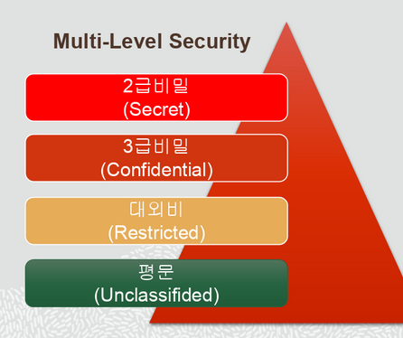

* 이번 순서는 "ols_t_pol" policy에서 사용될 OLS 컴포넌트들을 만듭니다. OLS의 모든 policy는 Level,Compartment,Group 이라는 3개의 Label 컴포넌트를 가질 수 있습니다. 각 Policy에서 Level 컴포넌트는 반드시 지정이 필요하지만 Compartment 또는 Group 은 업무조건에 따라 없을 수 있습니다.
* OLS의 각 Policy별로 Level,Compartment,Group은 short name과 long name을 가지며 각 컴포넌트들의 short name을 유니크한 십진수 값(Numeric tag)으로 치환하여 Dictionary 안에서 관리됩니다. "dba_sa_labels"(policy별 데이터 라벨 정보 확인), "dba_sa_user_levels()유저별 세션에 부여된 레벨 정보 확인) 뷰를 통하여 확인 할 수 있습니다.
* Level 컴포넌트에서 Neumeric Tag 값은 크기가 클수록 민감도가 높음을 의미합니다. Compartment, Group의 Netmeric tag 값은 유니크한 값을 나타내는 것 이외에 특별한 높낮이가 없습니다.

#### 1. Data에 대한 Level 컴포넌트 생성
* "Level"은 데이터에 대한 민감도를 의미합니다. 특히 Level 컴포넌트에서는 숫자값의 크기가 클수록 민감도가 높음을 의미합니다.
* 여기서는 군대에서 사용하는 비밀등급을 기준으로 민감도 level을 지정합니다. 군사자료는 "군사대외비"<"군사3급비밀"<"군사2급비밀" 순으로 민감도가 올라갑니다. 따라서 "군사대외비"는 11, "군사3급비밀"은 12, "군사2급비밀"은 13으로 지정하여 민감도 Neumeric tag를 지정합니다.

```SQL
conn lbacsys/Welcome1
EXEC sa_components.create_level(policy_name => 'doc_t_pol', level_num => 11, short_name => 'R', long_name => '군사대외비');
EXEC sa_components.create_level(policy_name => 'doc_t_pol', level_num => 12, short_name => 'C', long_name => '군사3급비밀');
EXEC sa_components.create_level(policy_name => 'doc_t_pol', level_num => 13, short_name => 'S', long_name => '군사2급비밀');

col long_name format a30
SELECT * FROM dba_sa_levels where policy_name = 'DOC_T_POL' ORDER BY level_num;
POLICY_NAME	      LEVEL_NUM SHORT_NAME		       LONG_NAME
-------------------- ---------- ------------------------------ ------------------------------
DOC_T_POL                    11 R                              군사대외비
DOC_T_POL                    12 C                              군사3급비밀
DOC_T_POL                    13 S                              군사2급비밀

```

* EM 화면

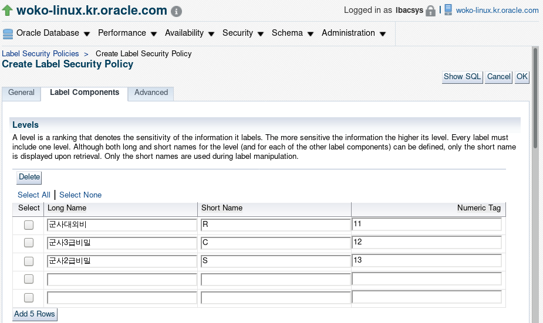

#### 2. Compartment 생성
* Compartment는 OLS 기본 컴포넌트 중에 하나입니다. Compartment를 식별하는 작업은 OLS 구현에 매우 중요합니다. 실제업무 환경에서는 접근통제 조건에 따라 다양한 Compartment 후보군을 찾을 수 있을 것입니다. 조직 내에서 동일 업무를 하는 직군 또는 특정 목적의 TF등 계층구조는 없으면서 데이터 민감도에 따라 구분하여 액세스 할 수 있는 그룹(?)을 후보군으로 선정하면 적절할 것입니다.
* 이 데모에서는 군사보안업무규정을 모델로 하여 3개의 Compartment를 식별하여 사용합니다. 실제 군대 환경에서는 "군사2급비취자", "군사3급비취자" 등으로 군사정보의 민감도에 따라 군사비밀을 다루는 권한을 부여하고 있으며 이 권한을 취득한 자만이 관련 비밀자료를 관리 할 수 있습니다. 비밀취급인가 수준에 따라 Multi Level Security 개념에 따라 데이터를 다뤄야 합니다. 즉, "군사2급비취자"는 2급, 3급, 대외비 자료를 관리할 수 있으며 "군사3급비취자"는 3급, 대외비 자료를 관리 할 수 있다는 의미입니다.

```SQL
EXEC sa_components.create_compartment(policy_name => 'doc_t_pol',comp_num => 21, short_name => 'SA', long_name => '군사2급비취자');
EXEC sa_components.create_compartment(policy_name => 'doc_t_pol',comp_num => 22, short_name => 'CA', long_name => '군사3급비취자');
EXEC sa_components.create_compartment(policy_name => 'doc_t_pol',comp_num => 23, short_name => 'GA', long_name => '보안서약자');

SELECT * FROM dba_sa_compartments where policy_name = 'DOC_T_POL' ORDER BY comp_num;
POLICY_NAME	       COMP_NUM SHORT_NAME		       LONG_NAME
-------------------- ---------- ------------------------------ ------------------------------
DOC_T_POL                    21 SA                             군사2급비취자
DOC_T_POL                    22 CA                             군사3급비취자
DOC_T_POL                    23 GA                             보안서약자
```

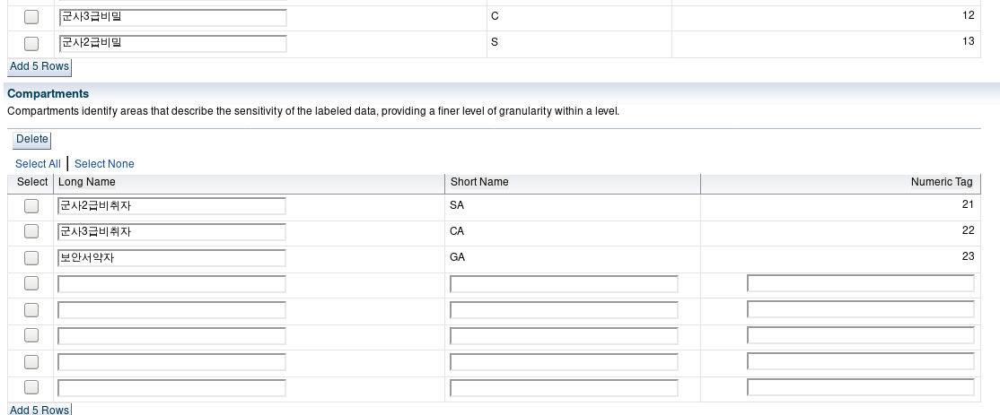

#### 3. Group 생성
* OLS에서 Group은 기본 컴포넌트 중에 하나입니다. OLS에서의 Group은 계층구조를 가지는 일반적인 조직 구조를 생각하면 됩니다.
* 조직 구조에서 계층적 구조의 특징은 상부조직은 하부조직의 업무를 관할할 수 있습니다. OLS에서도 상부조직은 하부조직의 업무와 데이터를 액세스 할 수 있는 특징을 가집니다.각 Group은 상부 Group을 지정할 수 있여 계층구조를 만들수 있습니다.

```SQL
EXEC sa_components.create_group(policy_name => 'doc_t_pol', group_num => 4000, short_name => 'AFHQ', long_name => 'Airforce HQ');
EXEC sa_components.create_group(policy_name => 'doc_t_pol', group_num => 4200, short_name => 'AFOC', long_name => 'AF Command Controls',parent_name => 'AFHQ');
EXEC sa_components.create_group(policy_name => 'doc_t_pol', group_num => 4202, short_name => 'AFOC_OP', long_name => 'AFOC 작전과', parent_name => 'AFOC');
EXEC sa_components.create_group(policy_name => 'doc_t_pol', group_num => 4204, short_name => 'AFOC_LOC', long_name => 'AFOC 군수과',parent_name => 'AFOC');
EXEC sa_components.create_group(policy_name => 'doc_t_pol', group_num => 1000, short_name => 'AHQ', long_name => 'Army HQ');
EXEC sa_components.create_group(policy_name => 'doc_t_pol', group_num => 1200, short_name => 'GOC', long_name => 'Army Command Controls',parent_name => 'AHQ');
EXEC sa_components.create_group(policy_name => 'doc_t_pol', group_num => 1202, short_name => 'GOC_OP', long_name => 'GOC 작전과',parent_name => 'GOC');
EXEC sa_components.create_group(policy_name => 'doc_t_pol', group_num => 1205, short_name => 'GOC_ICT', long_name => 'GOC 정통과',parent_name => 'GOC');

SELECT group_num,short_name,long_name,parent_num,parent_name FROM dba_sa_groups where policy_name = 'DOC_T_POL' ORDER BY group_num;
GROUP_NUM SHORT_NAME			  LONG_NAME			 PARENT_NUM PARENT_NAME
---------- ------------------------------ ------------------------------ ---------- --------------------
     1000 AHQ				  ARMY HQ
     1200 GOC				  ARMY COMMAND CONTROLS 	       1000 AHQ
     1202 GOC_OP                         GOC 작전과                           1200 GOC
     1205 GOC_ICT                        GOC 정통과                           1200 GOC
     4000 AFHQ 			  AIRFORCE HQ
     4200 AFOC 			  AF COMMAND CONTROLS		       4000 AFHQ
     4202 AFOC_OP                        AFOC 작전과                          4200 AFOC
     4204 AFOC_LOC                       AFOC 군수과                          4200 AFOC

/* DBA_SA_GROUP_HIERARCHY 뷰를 통하여 계층 구조를 확인 할 수 있음 */
SELECT * FROM DBA_SA_GROUP_HIERARCHY where policy_name = 'DOC_T_POL';
POLICY_NAME	     HIERARCHY_LEVEL GROUP_NAME
-------------------- --------------- ------------------------------
DOC_T_POL			   1   AHQ - ARMY HQ
DOC_T_POL			   2	 GOC - ARMY COMMAND CONTROL
				     S
DOC_T_POL                          3       GOC_OP - GOC 작전과
DOC_T_POL                          3       GOC_ICT - GOC 정통과
DOC_T_POL			   1   AFHQ - AIRFORCE HQ
DOC_T_POL			   2	 AFOC - AF COMMAND CONTROLS
DOC_T_POL                          3       AFOC_OP - AFOC 작전과
DOC_T_POL                          3       AFOC_LOC - AFOC 군수과

```

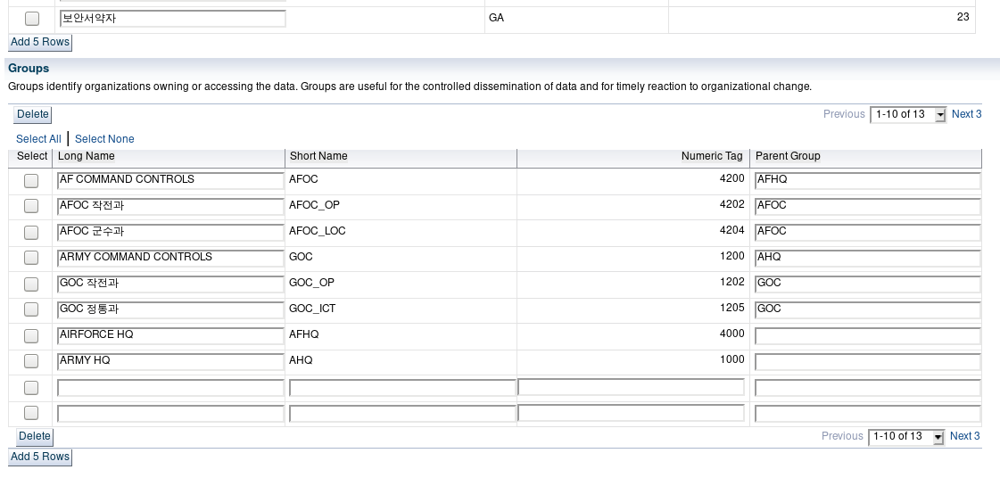

* 'doc_t_pol' policy를 위해 만든 컴포넌트들에 대한 EM 스크린 샷입니다.

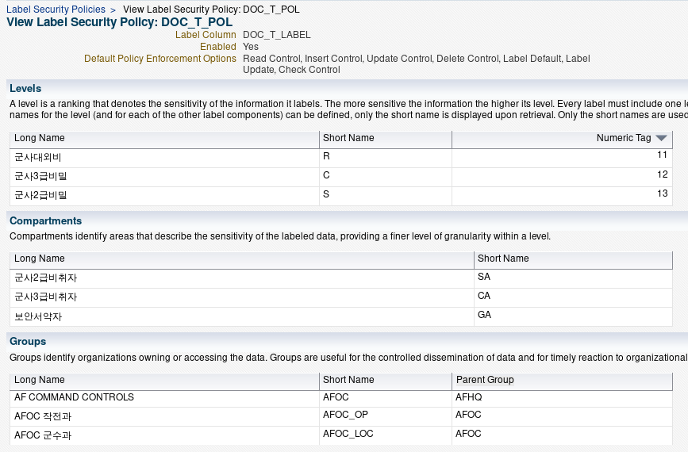

### Policy 적용
* 위에서 만들어진 Component를 포함하는 doc_t_pol policy를 docadmin.doc_t table에 적용합니다.

```SQL
EXEC sa_policy_admin.apply_table_policy(policy_name => 'doc_t_pol', schema_name => 'docadmin', table_name => 'doc_t',table_options => 'all_control');

conn docadmin/docadmin
desc docadmin.doc_t
Name			 Null?	  Type
 ----------------------- -------- ----------------
 DOC_NO 		 NOT NULL VARCHAR2(10)
 DOC_CREATOR		 NOT NULL VARCHAR2(20)
 DOC_TYPE		 NOT NULL VARCHAR2(10)
 DOC_STATE			  VARCHAR2(10)
 SIGN_ORG			  VARCHAR2(20)
 DIST_TARGET			  VARCHAR2(3000)
 CONTENT			  BLOB
 DOC_T_LABEL			  NUMBER(10)
```

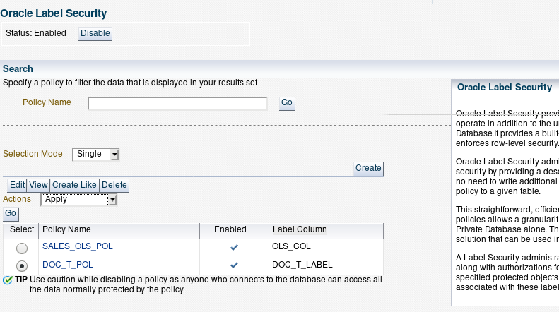

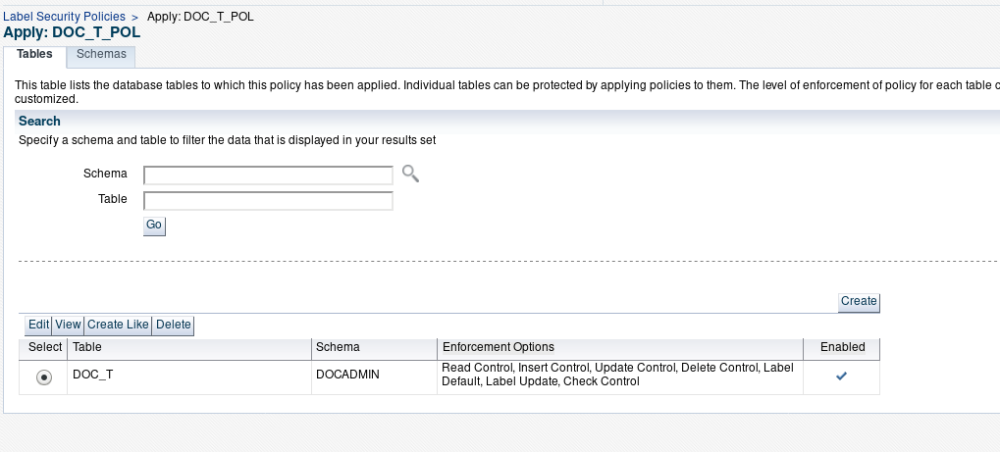

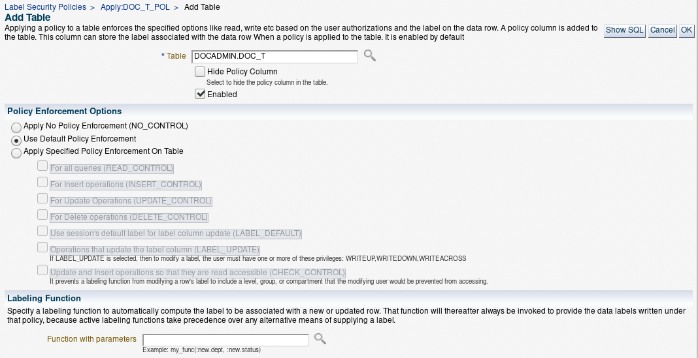

* 참고 : Apply된 policy를 삭제할 때는 다음과 같이 SQL command line으로 remove package를 실행합니다.
```SQL
EXEC sa_policy_admin.remove_table_policy(policy_name => 'doc_t_pol', schema_name => 'docadmin', table_name => 'doc_t', drop_column=> TRUE);
```

### 유저에게 권한(Privilege) 부여
* 현재까지 진행된 apply된 상태에서는 table owner인 경우에도 doc_t_pol policy 정책에 의하여 table 데이터에 액세스가 불가합니다. table에 쿼리를 해보면 "no row selected" 메세지가 나옵니다.
* 데모 진행을 원할히 하기 위하여 테이블 owner인 docadmin user에게는 모든 정책을 우회할 수 있는 권한을 부여합니다. 물론 필요에 따라 모든 정책을 우회하지 않고 적절하게 통제도 가능합니다.
* docuser에게 "profile_access" privelege를 부여합니다. docuser 계정을 통하여 set_access_profile로 세션정보를 가진 다른 유저에게(여기에서는 Profiled User들임) doc_t_pol 정책이 적용된 doc_t 테이블 데이터에 액세스할 수 있다는 것을 의미합니다.

```SQL
connn lbacsys
EXEC sa_user_admin.set_user_privs('doc_t_pol','docadmin','full');
EXEC sa_user_admin.set_user_privs('doc_t_pol','docuser','profile_access');
```

* 아직까지 doc_t_label 컬럼을 보시면 data label이 만들어지지 않았습니다.

```SQL
conn docadmin/docadmin

insert into docadmin.doc_t(doc_no,doc_creator,doc_type,doc_state, sign_org, content) values('20-0001','4202_01','2급','결재','AFOC_OP',UTL_RAW.CAST_TO_RAW('20-0001 문서는 2급 입니다'));

col label format a30
col content format a30
select doc_no,doc_creator,doc_type,doc_state, label_to_char(doc_t_label) label, UTL_RAW.CAST_TO_VARCHAR2(content) as content from docadmin.doc_t;

DOC_NO	   DOC_CREATOR		DOC_TYPE   DOC_STATE  LABEL			     CONTENT
---------- -------------------- ---------- ---------- ------------------------------ ------------------------------
20-0001    4202_01              2급        결재                                      20-0001 문서는 2급 입니다

/*다음 진행을 위하여 롤백합니다*/
rollback;
```

### Row data에 라벨링 하는 방법

* Row 데이터에 라벨링을 위한 방법은 아래 기술한 것 처럼 4가지 방법을 지원합니다. 이 데모에서는 4번째 방법인 "Label Function"을 만들어 사용하는 방법으로 진행합니다. 참고로 1번 방법을 추가하여 설명합니다.

 1. char_to_label 함수를 이용하여 line by line으로 라벨링하는 방법
 2. Numeric tag 값으로 직접 라벨링하는 방법
 3. User session에 "Default_Label"을 설정하여 라벨인 하는 방법
 4. Label Function을 만들어 자동으로 라벨링 하는 방법

* char_to_label 함수를 이용하여 line by line으로 라벨인 하는 방법

```SQL
 insert into docadmin.doc_t(doc_no,doc_creator,doc_type,doc_state, sign_org, content, doc_t_label) values('20-0001','4202_01','2급','결재','AFOC_OP',UTL_RAW.CAST_TO_RAW('20-0001 문서는 2급 입니다'), char_to_label('doc_t_pol','S:SA'));

 select doc_no,doc_creator,doc_type,doc_state, label_to_char(doc_t_label) label, UTL_RAW.CAST_TO_VARCHAR2(content) as content from docadmin.doc_t;

 DOC_NO	   DOC_CREATOR		DOC_TYPE   DOC_STATE  LABEL			     CONTENT
 ---------- -------------------- ---------- ---------- ------------------------------ ------------------------------
 20-0001    4202_01              2급        결재       S:SA                           20-0001 문서는 2급 입니다

/* 이 데모에서는 이 방법을 사용하지 않습니다. 다음 진행을 위하여 롤백합니다. */
 rollback;  
```

### Label Function 생성 및 doc_t_pol 정책에 attatch 하기
* Label Function은 OLS Policy가 적용된 테이블 row별로 자동 라벨인하는 방법을 제공합니다.
* 먼저 아래와 같이 1) Function을 만들고 2) 이 Function의 실행 권한을 LBACSYS에게 부여합니다. 3) LBACSYS에서 doc_t_pol 정책에 다시 apply합니다. 이 과정에서 기존에 apply 되어 있던 policy를 제거 한 후에 다시 policy를 apply하면 error를 피할 수 있습니다.

```SQL
conn docadmin/docadmin

CREATE OR REPLACE FUNCTION gen_doc_t_label
(doc_type VARCHAR2, doc_state VARCHAR2, sign_org VARCHAR2, dist_target VARCHAR2)
RETURN lbacsys.lbac_label
AS
  i_label VARCHAR2(1000);
BEGIN
  /************* assign data levels **************/
  IF doc_type='2급' THEN
    i_label := 'S:';
  ELSIF doc_type='3급' THEN
    i_label := 'C:';
  ELSIF doc_type='대외비' THEN
    i_label := 'R:';
  END IF;
  /************** assign compartments *************/
  CASE doc_type
      WHEN '2급' THEN
        i_label := i_label || 'SA';
      WHEN '3급' THEN
        i_label := i_label || 'CA';
      WHEN '대외비' THEN
        i_label := i_label || 'GA';
  END CASE;
   /************* assign groups *************/
  CASE doc_state
    WHEN '결재'  THEN
        i_label := i_label ||':'|| sign_org ;
    WHEN '배부' THEN
         i_label := i_label ||':'|| sign_org || ',' || dist_target;
  END CASE;

  /********* return Datat label *************/

   RETURN to_lbac_data_label('doc_t_pol',i_label);

END;
/
/* gen_doc_t_label 실행 권한을 LBACSYS에게 줍니다 */
grant execute on docadmin.gen_doc_t_label to lbacsys;  
```
* Label Function이 적용되면 User session lable에 적용된 Default_label 값보다 우선 적용됩니다.
* Label Function을 적용한 Policy로 다시 Update 합니다.

```SQL
EXEC sa_policy_admin.apply_table_policy(policy_name => 'doc_t_pol', schema_name => 'docadmin', table_name => 'doc_t',table_options => 'all_control', label_function => 'docadmin.gen_doc_t_label(:new.doc_type,:new.doc_state,:new.sign_org,:new.dist_target)');
```
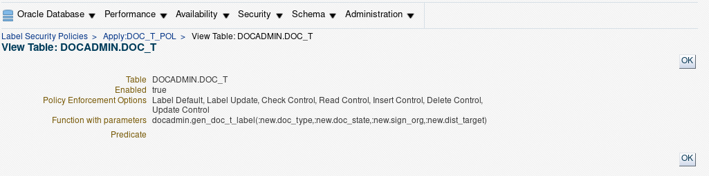

* Label Function이 적용된 상태에서 데이터를 입력합니다. 입력 후 doc_t 테이블을 조회하면 자동으로 라벨링이 된 것을 확인 할 수 있습니다.

```SQL
conn docadmin/docadmin
insert into docadmin.doc_t(doc_no,doc_creator,doc_type,doc_state, sign_org, content) values('20-0001','4202_01','2급','결재','AFOC_OP',UTL_RAW.CAST_TO_RAW('20-0001 문서는 2급 입니다'));
insert into docadmin.doc_t(doc_no,doc_creator,doc_type,doc_state, sign_org, content) values('20-0002','4202_01','3급','결재','AFOC_OP',UTL_RAW.CAST_TO_RAW('20-0002 문서는 3급 입니다'));
insert into docadmin.doc_t(doc_no,doc_creator,doc_type,doc_state, sign_org, content) values('20-0003','4202_02','대외비','결재','AFOC_OP',UTL_RAW.CAST_TO_RAW('20-0003 문서는 대외비 입니다'));
commit;

set line 200
col dist_target forma a30
col label format a30
col content format a30
select doc_no,doc_creator,doc_type,doc_state, sign_org,label_to_char(doc_t_label) label, UTL_RAW.CAST_TO_VARCHAR2(content) as content from docadmin.doc_t;

```
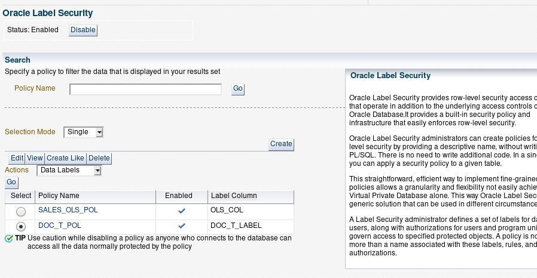
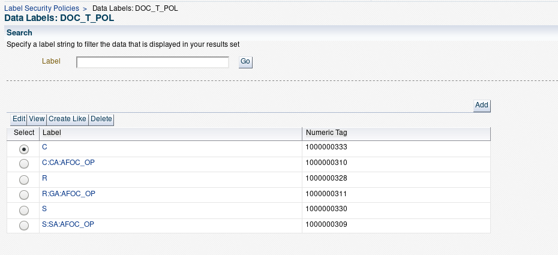
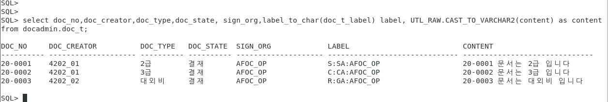

### Assumed user를 통합 데이터 접근통제
* doc_t_pol 정책이 적용된 테이블에는 마치 네트워크 방화벽에서 초기상태 처럼 docadmin user 외에는 어느 누구도 액세스를 할 수 없습니다. Row에 Data label 된 이후에는 User session label 값과 Data label 값을 기준으로 OLS에 내장된 Access meidiation 알고리즘에 의하여 액세스가 통제됩니다.
* 다음 작업은 방화벽의 화이트 리스트를 만드는 작업과 같은 작업으로 Assumed user와 Profiled user(비밀관리계정)에게 privilege 부여하여 라벨된 데이터에 접근하는 방법을 진행하겠습니다.

#### Access Mediation 적용 상태 확인
* user session에 라벨 권한을 받지 못한 어떤 user Session에 대해서도 docadmin.doc_t 테이블에 접근을 허용하지 않습니다. 만약 비승인 세션이 접근할 경우에는 DB 커널에서 강제로 접근을 차단시키고 아래와 같은 에러 메세지를 리턴할 것입니다.
* docuser는 Assumed user로 자기 자신의 계정 권한으로 docadmin.doc_t 테이블에 접근을 할 수 없습니다. 또한 profiled user라 할지라도  아직까지는 어떤 데이터에도 액세스를 할 수 없습니다.

```SQL
conn docuser/docuser
insert into docadmin.doc_t(doc_no,doc_creator,doc_type,doc_state, sign_org, content) values('20-0004','4202_02','대외비','결재','AFOC_OP',UTL_RAW.CAST_TO_RAW('20-0004 문서는 대외비 입니다'));
==> error ORA-28115: policy with check option violation

exec sa_session.set_access_profile(policy_name => 'doc_t_pol', user_name => 'U4202_03');

ERROR at line 1:
ORA-12407: unauthorized operation for policy
ORA-06512: at "LBACSYS.SA_SESSION", line 636
ORA-06512: at "LBACSYS.SA_SESSION", line 661
ORA-06512: at "LBACSYS.SA_SESSION", line 775
ORA-06512: at line 1

SELECT sa_session.sa_user_name(policy_name => 'doc_t_pol') FROM dual;
SELECT sa_session.label(policy_name => 'doc_t_pol') FROM dual;
SELECT sa_session.comp_read(policy_name => 'doc_t_pol') FROM dual;
SELECT sa_session.comp_read(policy_name => 'doc_t_pol') FROM dual;

```

#### Profiled user의 user session에 label 권한 할당
* 앞 에서 만든 profiled user를 활용하여 doc_t 테이블에 액세스를 하기 위하여 각 user session에 level, compartment, group 을 할당합니다. 이 것은 user session이 어떤 데이터에 access 할 수 있는지에 대한 privilege를 할당하는 의미입니다.
* "U4202_03","U4202_02" user 와 같은 profiled user 별로 비밀취급인가 수준과 소속 속성값에 부합하도록 Level, Compartment, Group 을 할달합니다.
* "U4202_03" profiled user에 대한 user session level 설정과 상세 설명을 아래에 추가합니다.
 * U4202_03 user는 비밀서약서만 가지는 사용자로서 2, 3급 비밀을 다룰수 없지만 대외비를 조회할 수 있습니다. 따라서 user session에 최대 액세스 할 수 있는 라벨값인 Max_level은 "R", 최소 액세스 할 수 있는 라벨값은 "R", 로그인 할때 기본적으로 가지고 Default 라벨값의 level은 "R", Row write 할때 사용할 수 있는 라벨값으로 level "R" 권한을 할당합니다.
 * 이 유저에게는 비밀서약자 권한인 'GA'를 compartment로 추가하여 Compartment의 data level이 'GA'로 라벨된 row에 Read only 모드로 액세스할 수 있는 권한을 부여합니다. 아울러 이 세션이 로그인 할때 기본적으로 'GA' 컴파트먼트에 액세스 할 수 있는지 여부를 할당합니다. "in_def" 값으로 "Y" 또는 "N"를 사용합니다. "Y"인 경우에는 유저 세션이 새션 로그인 될때 "GA"에 액세스 할 수 있는 권한이 자동으로 할당되어 'GA' 컴파트먼트 라벨된 데이터에 액세스 할 수 있습니다. "in_def" 값이 "N"일 경우에는 세션이 로그인 할때 로그인 세션에 별도로 'GA'에 액세스 할 수 있는 권한을 부여하지 않으면 'GA' compartment로 label 된 row 데이터에 액세스 할 없습니다. "in_row"는 테이블에 데이터를 insert할 때 'GA' 컴파트먼트 level 값을 명시할 것인지의 여부를 지정하는 타입으로 "Y" 또는 "N"를 지정할 수 있습니다. "Y"인 경우는 세션이 데이터를 isert하면서 컴파트먼트 권한에 "default_level"로 지정된 값으로 값으로 라벨링을 한다는 의미이며 "N"인 경우에는 "default_level" 값을 사용하지 않는 다는 의미입니다. 이 데모에서는 Label Function을 사용하여 데이터에 대한 라벨링이 자동으로 수행되도록 했기 때문에 "N"로 설정합니다.
 * U4203_03 유저 세션에게 "Group"에 대한 권한은 "AFOC_OP"를 할당합니다. Group의 date level에 "AFOC_OP"로 라벨이 되어있는 row에 Read only 모드로 액세스 할 수 있는 권한을 부여합니다. 나머지 설정값은 컴파트먼트 설정을 설명한 내용과 의미가 같기 때문에 생략합니다.단, 할당된 Group이 상위에 계층구조를 가지고 있다면 상위 Group에서는 이 권한을 상속을 받습니다.

```SQL
conn docadmin/docadmin
/* 유저 U4202_03 작업 */
EXEC sa_user_admin.set_levels(policy_name => 'doc_t_pol', user_name => 'U4202_03', max_level => 'R', min_level => 'R', def_level => 'R', row_level => 'R');
EXEC SA_USER_ADMIN.ADD_COMPARTMENTS(policy_name => 'doc_t_pol', user_name => 'U4202_03', comps => 'GA', access_mode => SA_UTL.READ_ONLY, in_def => 'Y', in_row => 'N');
EXEC SA_USER_ADMIN.ADD_GROUPS(policy_name => 'doc_t_pol', user_name => 'U4202_03', groups => 'AFOC_OP', access_mode => SA_UTL.READ_ONLY, in_def => 'Y', in_row => 'N');

conn docuser/docuser
exec sa_session.set_access_profile(policy_name => 'doc_t_pol', user_name => 'U4202_03');
SELECT sa_session.label(policy_name => 'doc_t_pol') FROM dual;
set line 200
col dist_target forma a30
col label format a30
col content format a30
select doc_no,doc_creator,doc_type,doc_state, sign_org,dist_target, label_to_char(doc_t_label) label, UTL_RAW.CAST_TO_VARCHAR2(content) as content from docadmin.doc_t;
```

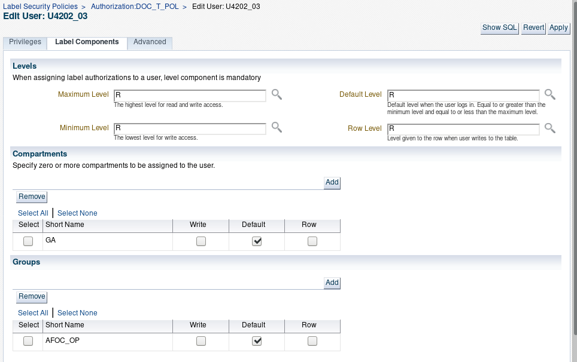

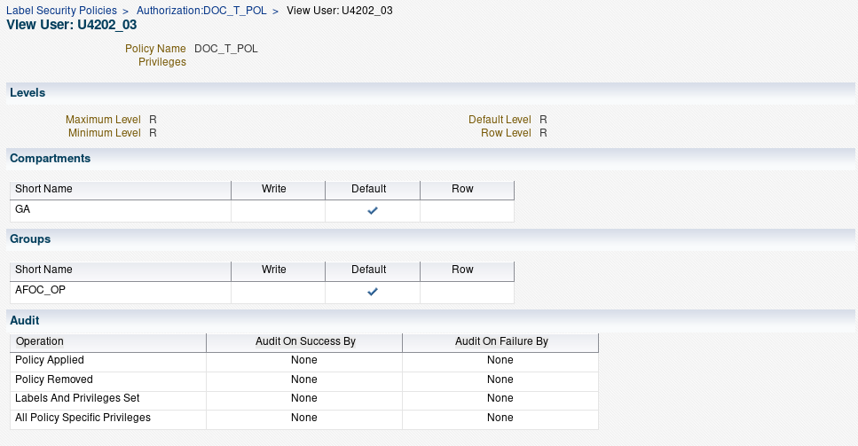


### user session level 추가
* U4202_03 user와 같이 U4202_00, U4202_01, U4202_02 user에게 user session level을 설정합니다.

```SQL
conn docadmin/docadmin

/* 유저 U4202_00 작업 */
EXEC sa_user_admin.set_levels(policy_name => 'doc_t_pol', user_name => 'U4202_00', max_level => 'S', min_level => 'R', def_level => 'S', row_level => 'S');
EXEC SA_USER_ADMIN.ADD_COMPARTMENTS(policy_name => 'doc_t_pol', user_name => 'U4202_00', comps => 'SA,CA,GA', access_mode => SA_UTL.READ_ONLY, in_def => 'Y', in_row => 'N');
EXEC SA_USER_ADMIN.ADD_GROUPS(policy_name => 'doc_t_pol', user_name => 'U4202_00', groups => 'AFOC_OP', access_mode => SA_UTL.READ_ONLY, in_def => 'Y', in_row => 'N');

/* 유저 U4202_01 작업 */
EXEC sa_user_admin.set_levels(policy_name => 'doc_t_pol', user_name => 'U4202_01', max_level => 'S', min_level => 'R', def_level => 'S', row_level => 'S');
EXEC SA_USER_ADMIN.ADD_COMPARTMENTS(policy_name => 'doc_t_pol', user_name => 'U4202_01', comps => 'SA,CA,GA', access_mode => SA_UTL.READ_ONLY, in_def => 'Y', in_row => 'N');
EXEC SA_USER_ADMIN.ADD_GROUPS(policy_name => 'doc_t_pol', user_name => 'U4202_01', groups => 'AFOC_OP', access_mode => SA_UTL.READ_ONLY, in_def => 'Y', in_row => 'N');

/* 유저 U4202_02 작업 */
EXEC sa_user_admin.set_levels(policy_name => 'doc_t_pol', user_name => 'U4202_02', max_level => 'C', min_level => 'R', def_level => 'C', row_level => 'C');
EXEC SA_USER_ADMIN.ADD_COMPARTMENTS(policy_name => 'doc_t_pol', user_name => 'U4202_02', comps => 'CA,GA', access_mode => SA_UTL.READ_ONLY, in_def => 'Y', in_row => 'N');
EXEC SA_USER_ADMIN.ADD_GROUPS(policy_name => 'doc_t_pol', user_name => 'U4202_02', groups => 'AFOC_OP', access_mode => SA_UTL.READ_ONLY, in_def => 'Y', in_row => 'N');
```

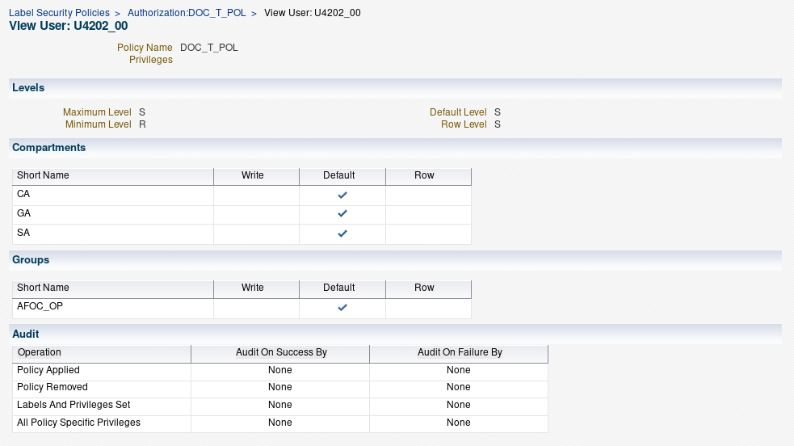

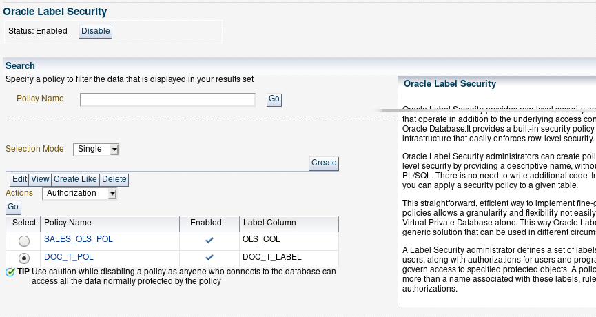

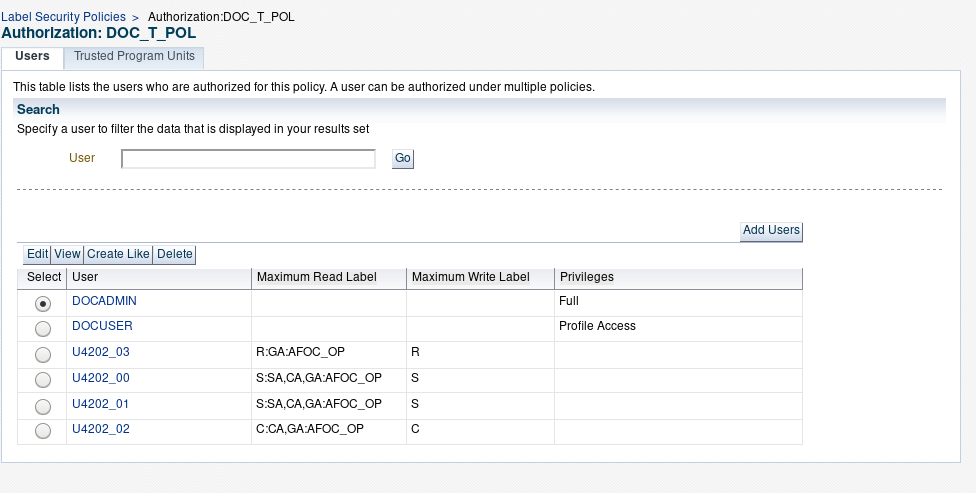

* 참고 : user session level 수정 명령어
```SQL
EXEC SA_USER_ADMIN.SET_USER_LABELS(policy_name => 'doc_t_pol',user_name => 'U4202_03',max_read_label =>'R:GA:AFOC_OP');
EXEC SA_USER_ADMIN.ALTER_COMPARTMENTS(policy_name => 'DOC_T_POL', user_name => 'U4202_02', comps => 'GA', access_mode => LBACSYS.SA_UTL.READ_ONLY, in_def => 'Y', in_row => 'N');
exec SA_USER_ADMIN.ALTER_GROUPS(policy_name => 'DOC_T_POL', user_name => 'U4202_03', groups => 'AFOC_OP', access_mode => LBACSYS.SA_UTL.READ_ONLY, in_def => 'Y', in_row => 'N');
```
## 데이터 접근통제 검증

### profiled user를 통한 데이터 접근 및 통제 검증
* docadmin.doc_t 테이블 데이터에 대한 액세스는 docuser를 통해서 Profile_Access 프로시져에 의해 Authorization과 privilege로 승인된 세션만 허용합니다. sa_session.set_access_profile은 OLS 인증과 권한을 설정하는 프로시저입니다. 이 프로시저를 실행하기 위해서는 반드시 Profile_Access privelege 가지고 있어야 합니다.
* Profile_Access privelege를 가진 docuser로 로그인을 한 후 유저 세션을 U4202_00( U4202_01, U4202_02) 유저로 지정하고 세션 정보를 확인합니다.
 * U4202_00, U4202_01 유저(세션)는 AFOC_OP 그룹 소속의 2급 비밀취급인가자로서 2급, 3급, 대외비 데이터에 액세스 할 수 있는 것을 확인할 수 있습니다.
 * U4202_02 유저는 3급 비밀취급인가자로서 3급, 대외비 데이터에 액세스 할 수 있음을 확인 할 수 있습니다.

```SQL
conn docuser/docuser
/* U4202_00 user 세션으로 설정*/
exec sa_session.set_access_profile(policy_name => 'doc_t_pol', user_name => 'U4202_00');
SELECT sa_session.sa_user_name(policy_name => 'doc_t_pol') FROM dual;
SA_SESSION.SA_USER_NAME(POLICY_NAME=>'DOC_T_POL')
-------------------------------------------------
U4202_00

SELECT sa_session.label(policy_name => 'doc_t_pol') FROM dual;
SA_SESSION.LABEL(POLICY_NAME=>'DOC_T_POL')
------------------------------------------
S:SA,CA,GA:AFOC_OP

SELECT sa_session.comp_read(policy_name => 'doc_t_pol') FROM dual;
SA_SESSION.COMP_READ(POLICY_NAME=>'DOC_T_POL')
-----------------------------------------------
SA,CA,GA
SELECT sa_session.group_read(policy_name => 'doc_t_pol') FROM dual;
SA_SESSION.GROUP_READ(POLICY_NAME=>'DOC_T_POL')
-------------------------------------------------
AFOC_OP

set line 200
col dist_target forma a30
col label format a30
col content format a30
select doc_no,doc_creator,doc_type,doc_state, sign_org, UTL_RAW.CAST_TO_VARCHAR2(content) as content from docadmin.doc_t;
DOC_NO	   DOC_CREATOR		DOC_TYPE   DOC_STATE  SIGN_ORG		   CONTENT
---------- -------------------- ---------- ---------- -------------------- ------------------------------
20-0001    4202_01              2급        결재       AFOC_OP              20-0001 문서는 2급 입니다
20-0002    4202_01              3급        결재       AFOC_OP              20-0002 문서는 3급 입니다
20-0003    4202_02              대외비     결재       AFOC_OP              20-0003 문서는 대외비 입니다

/* U4202_01 user 세션으로 설정*/
exec sa_session.set_access_profile(policy_name => 'doc_t_pol', user_name => 'U4202_01');
SELECT sa_session.sa_user_name(policy_name => 'doc_t_pol') FROM dual;

select doc_no,doc_creator,doc_type,doc_state, sign_org, UTL_RAW.CAST_TO_VARCHAR2(content) as content from docadmin.doc_t;
DOC_NO	   DOC_CREATOR		DOC_TYPE   DOC_STATE  SIGN_ORG		   CONTENT
---------- -------------------- ---------- ---------- -------------------- ------------------------------
20-0001    4202_01              2급        결재       AFOC_OP              20-0001 문서는 2급 입니다
20-0002    4202_01              3급        결재       AFOC_OP              20-0002 문서는 3급 입니다
20-0003    4202_02              대외비     결재       AFOC_OP              20-0003 문서는 대외비 입니다

/* U4202_02 user 세션으로 설정*/
exec sa_session.set_access_profile(policy_name => 'doc_t_pol', user_name => 'U4202_02');
SELECT sa_session.sa_user_name(policy_name => 'doc_t_pol') FROM dual;
select doc_no,doc_creator,doc_type,doc_state, sign_org, UTL_RAW.CAST_TO_VARCHAR2(content) as content from docadmin.doc_t;
DOC_NO	   DOC_CREATOR		DOC_TYPE   DOC_STATE  SIGN_ORG		   CONTENT
---------- -------------------- ---------- ---------- -------------------- ------------------------------
20-0002    4202_01              3급        결재       AFOC_OP              20-0002 문서는 3급 입니다
20-0003    4202_02              대외비     결재       AFOC_OP              20-0003 문서는 대외비 입니다
```

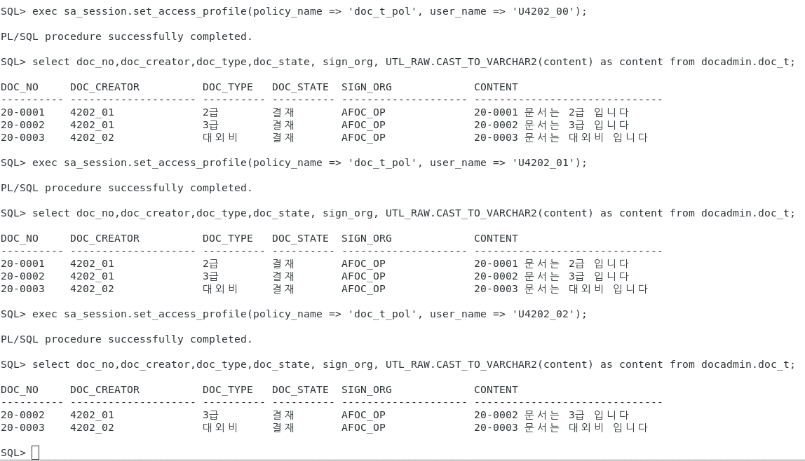

### Update 제어 확인

* AFOC_OP 소속의 비밀서약자 권한('GA')을 가지는 U4203_03 유저 세션은 대외비('R') 문서에 액세스 권한만 가지고 있기 때문에 대외비 문서를 포함한 2급(S), 3급(C) 문서의 수정은 허용하지 않습니다. 아래 예제에서 처럼 2급, 3급 문서의 경우는 Update 조건절에서 부터 2급, 3급 문서에 액세스를 하지 못했기 때문에 "0"건 updated 됐다고 메세지가 리턴되지만, 대외비를 수정하는 update 문에서는 "ORA-12406: unauthorized SQL statement for policy DOC_T_POL"와 같은 에러메세지가 리턴되면서 policy에 의해 거부됨을 확인 할 수 있습니다. 아울러 U4202_03 유저 세션은 대외비 문서는 insert를 허용하지만 변경이 거부됨을 확인 할 수 있습니다.
* 특히, 이 예제에서는 유저 세션에 compartment, group에 대한 Read only 권한만을 부여 했기 때문에 Data label 값에 compartmant, group이 포함 된 데이터는 "delete" 작업수행을 할 수 없는 것을 확인 할 수 있을 것입니다.

```sql
exec sa_session.set_access_profile(policy_name => 'doc_t_pol', user_name => 'U4202_03');
SELECT sa_session.sa_user_name(policy_name => 'doc_t_pol') FROM dual;
/* U4202_03 user의 2급 문서 변경 */
update docadmin.doc_t set content = UTL_RAW.CAST_TO_RAW('2급 문서 업데이트 테스트 입니다') where doc_no = '20-0001';
0 rows updated.

/* U4202_03 user의 3급 문서 변경 */
update docadmin.doc_t set content = UTL_RAW.CAST_TO_RAW('3급 문서 업데이트 테스트 입니다') where doc_no = '20-0002';
0 rows updated.

/* U4202_03 user의 대외비 문서 변경 */
update docadmin.doc_t set content = UTL_RAW.CAST_TO_RAW('대외비 업데이트 테스트 입니다') where doc_no = '20-0003';

ERROR at line 1:
ORA-12406: unauthorized SQL statement for policy DOC_T_POL
ORA-06512: at "LBACSYS.LBAC_STANDARD", line 20
ORA-06512: at "LBACSYS.LBAC$AU1_333425", line 1
ORA-04088: error during execution of trigger 'LBACSYS.LBAC$AU1_333425'

/* U4202_03 user의 대외비 문서 삽입 */
insert into docadmin.doc_t(doc_no,doc_creator,doc_type,doc_state, sign_org, content) values('20-0004','4202_03','대외비','결재','AFOC_OP',UTL_RAW.CAST_TO_RAW('20-0004 문서는 대외비 입니다'));
1 row created.
commit;

/* U4202_03 user의 대외비 문서 변경 */
update docadmin.doc_t set content = UTL_RAW.CAST_TO_RAW('20-0004 문서 업데이트 테스트 입니다') where doc_no = '20-0004';
ERROR at line 1:
ORA-12406: unauthorized SQL statement for policy DOC_T_POL
ORA-06512: at "LBACSYS.LBAC_STANDARD", line 20
ORA-06512: at "LBACSYS.LBAC$AU1_333425", line 1
ORA-04088: error during execution of trigger 'LBACSYS.LBAC$AU1_333425'

/* U4202_03 user의 3급 비밀문서 삽입 */
insert into docadmin.doc_t(doc_no,doc_creator,doc_type,doc_state, sign_org, content) values('20-0005','4202_03','3급','결재','AFOC_OP',UTL_RAW.CAST_TO_RAW('20-0005 문서는3급 문서 입니다'));

ERROR at line 1:
ORA-28115: policy with check option violation

/* U4202_03 user의 대외비 문서 삭제 */
delete docadmin.doc_t where doc_no = '20-0004';
ERROR at line 1:
ORA-12406: unauthorized SQL statement for policy DOC_T_POL

```
* AFOC_OP 소속의 U4202_02 유저 세션은 3급비밀취급인가를 받은 자로서, 3급 비밀을 포함한 하위 비밀을 생산, 관리 할 수 있는 권한을 가지고 있습니다. 아래 예제는 이런 특징을 반영한 정책을 확인할 수 있는 예제입니다.

```sql
show user
USER is "DOCUSER"

exec sa_session.set_access_profile('doc_t_pol','U4202_02');
set line 200
col Ses_user format a10
col Ses_label format a20
col Ses_comp format a30
col Ses_group format a30
SELECT sa_session.sa_user_name(policy_name => 'doc_t_pol') Ses_user, sa_session.label(policy_name => 'doc_t_pol') Ses_Label, sa_session.comp_read(policy_name => 'doc_t_pol') Ses_Comp, sa_session.group_read(policy_name => 'doc_t_pol') Ses_group FROM dual;
SES_USER   SES_LABEL		SES_COMP		       SES_GROUP
---------- -------------------- ------------------------------ ------------------------------
U4202_02   C:CA,GA:AFOC_OP	CA,GA			       AFOC_OP

/* U4202_02 user의 3급 비밀문서 삽입 */
insert into docadmin.doc_t(doc_no,doc_creator,doc_type,doc_state, sign_org, content) values('20-0005','4202_02','3급','결재','AFOC_OP',UTL_RAW.CAST_TO_RAW('20-0005 문서는 3급 문서 입니다'));
1 row created.
commit;

/* U4202_02 user의 2급 비밀문서 삽입 */
insert into docadmin.doc_t(doc_no,doc_creator,doc_type,doc_state, sign_org, content) values('20-0006','4202_02','2급','결재','AFOC_OP',UTL_RAW.CAST_TO_RAW('20-0006 문서는 2급 문서 입니다'));
ERROR at line 1:
ORA-28115: policy with check option violation

/* U4202_02 user의 대외비 문서 삽입 */
insert into docadmin.doc_t(doc_no,doc_creator,doc_type,doc_state, sign_org, content) values('20-0006','4202_02','대외비','결재','AFOC_OP',UTL_RAW.CAST_TO_RAW('20-0006 문서는 대외비 문서 입니다'));
1 row created.
commit;

delete docadmin.doc_t where doc_no = '20-0006';
ERROR at line 1:
ORA-12406: unauthorized SQL statement for policy DOC_T_POL

update docadmin.doc_t set content = UTL_RAW.CAST_TO_RAW('20-0006 문서는 2급 문서 업데이트 테스트  입니다') where doc_no = '20-0006';
ERROR at line 1:
ORA-12406: unauthorized SQL statement for policy DOC_T_POL
ORA-06512: at "LBACSYS.LBAC_STANDARD", line 20
ORA-06512: at "LBACSYS.LBAC$AU1_333425", line 1
ORA-04088: error during execution of trigger 'LBACSYS.LBAC$AU1_333425'
```

* 이런 특징은 군 비밀문서 관리 특징을 그대로 구현할 수 있는 방법을 제공합니다.

### Group 컴포넌트에 의한 상속된 권한 검증
* U4200_00 유저세션 level 설정
 * U4200_00 유저는 AFOC HQ 그룹 속성을 가진 유저입니다. AFOC HQ는 AFOC_OC의 상위 그룹이며 두 그룹의 관ㄹ계는 Parent-Child 구주의 계층구조를 가집니다. 따라서 AFOC_OC가 액세스 할 수 있는 Data label 데이터 값을 가지는 Row에 액세스 할 수 있는 권한을 상속 받는 것을 확인할 수 있습니다.  
 * U4200_00 유저 세션에 2급 비밀 데이터에 액세스 할 수 있는 권한과 Data Label값이 Compartment SA, CA, GA와 Group AFOC인 row에 대한 Read only 권한을 부여합니다.
 * 이번 U4200_00 유저 세션 예제에서는 compartment와 Group 컴포넌트 Session Level은 "in_def" 권한을 "N"으로 주고 로그인 할때 Default 값으로 가지는 권한이 아닌 세션정보를 생성할 때 액세스 권한을 부여하는 방법으로 진행합니다.

```SQL
conn docadmin/docadmin
EXEC sa_user_admin.set_levels(policy_name => 'doc_t_pol', user_name => 'U4200_00', max_level => 'S', min_level => 'R', def_level => 'S', row_level => 'R');
EXEC SA_USER_ADMIN.ADD_COMPARTMENTS(policy_name => 'doc_t_pol', user_name => 'U4200_00', comps => 'SA,CA,GA', access_mode => SA_UTL.READ_ONLY, in_def => 'N', in_row => 'N');
EXEC SA_USER_ADMIN.ADD_GROUPS(policy_name => 'doc_t_pol', user_name => 'U4200_00', groups => 'AFOC', access_mode => SA_UTL.READ_ONLY, in_def => 'N', in_row => 'N');

-- 4202_01 user 에게 write 권한 부여 for updating
conn docuser/docuser
exec sa_session.set_access_profile(policy_name => 'doc_t_pol', user_name => 'U4200_00');

SELECT sa_session.sa_user_name(policy_name => 'doc_t_pol') Ses_user, sa_session.label(policy_name => 'doc_t_pol') Ses_Label, sa_session.comp_read(policy_name => 'doc_t_pol') Ses_Comp, sa_session.group_read(policy_name => 'doc_t_pol') Ses_group FROM dual;
SES_USER   SES_LABEL		SES_COMP		       SES_GROUP
---------- -------------------- ------------------------------ ------------------------------
U4200_00   Sset line 200

/* User session level에 라벨 권한 부여하기 전 상태임 */
col label format a30
col content format a30
select doc_no,doc_creator,doc_type,doc_state, sign_org,label_to_char(doc_t_label) label, UTL_RAW.CAST_TO_VARCHAR2(content) as content from docadmin.doc_t;
no rows selected

/* User session level에 라벨 권한 부여*/
exec sa_session.set_label('doc_t_pol','S:SA,CA,GA:AFOC');
select doc_no,doc_creator,doc_type,doc_state, sign_org, label_to_char(doc_t_label) label, UTL_RAW.CAST_TO_VARCHAR2(content) as content from docadmin.doc_t;
DOC_NO	   DOC_CREATOR		DOC_TYPE   DOC_STATE  SIGN_ORG		   LABEL			  CONTENT
---------- -------------------- ---------- ---------- -------------------- ------------------------------ ------------------------------
20-0001    4202_01              2급        결재       AFOC_OP              S:SA:AFOC_OP                   20-0001 문서는 2급 입니다
20-0002    4202_01              3급        결재       AFOC_OP              C:CA:AFOC_OP                   20-0002 문서는 3급 입니다
20-0003    4202_02              대외비     결재       AFOC_OP              R:GA:AFOC_OP                   20-0003 문서는 대외비 입니다
20-0004    4202_03              대외비     결재       AFOC_OP              R:GA:AFOC_OP                   20-0004 문서는 대외비 입니다
20-0005    4202_02              3급        결재       AFOC_OP              C:CA:AFOC_OP                   20-0005 문서는 3급 문서 입니다
20-0006    4202_02              대외비     결재       AFOC_OP              R:GA:AFOC_OP                   20-0006 문서는 대외비 문서 입
                                                                                                         니다
6 rows selected.

insert into docadmin.doc_t(doc_no,doc_creator,doc_type,doc_state, sign_org, content) values('20-0007','4000_00','대외비','결재','AFOC',UTL_RAW.CAST_TO_RAW('20-0007 문서는 대외비 문서 입니다'));
commit;
/* User session에 Compartment, Group에 대한 Read_write 권한이 없기 때문에 에러를 리턴함 */
update docadmin.doc_t set content = UTL_RAW.CAST_TO_RAW('20-0007 문서 업데이트 테스트 입니다') where doc_no = '20-0007';
  ERROR at line 1:
  ORA-12406: unauthorized SQL statement for policy DOC_T_POL
  ORA-06512: at "LBACSYS.LBAC_STANDARD", line 20
  ORA-06512: at "LBACSYS.LBAC$AU1_333425", line 1
  ORA-04088: error during execution of trigger 'LBACSYS.LBAC$AU1_333425'

/* User session에 Compartment, Group에 대한 Read_write 권한 할당 */

conn docadmin/docadmin
EXEC SA_USER_ADMIN.ALTER_COMPARTMENTS(policy_name => 'DOC_T_POL', user_name => 'U4200_00', comps => 'SA,CA,GA', access_mode => LBACSYS.SA_UTL.READ_WRITE, in_def => 'N', in_row => 'N');
exec SA_USER_ADMIN.ALTER_GROUPS(policy_name => 'DOC_T_POL', user_name => 'U4200_00', groups => 'AFOC', access_mode => LBACSYS.SA_UTL.READ_WRITE, in_def => 'Y', in_row => 'N');

conn docuse/docuser
exec sa_session.set_access_profile(policy_name => 'doc_t_pol', user_name => 'U4200_00');
exec sa_session.set_label('doc_t_pol','S:SA,CA,GA:AFOC');
update docadmin.doc_t set content = UTL_RAW.CAST_TO_RAW('20-0007 문서 업데이트 테스트 입니다') where doc_no = '20-0007';
1 row updated.
```
#### 상속관계가 없는 타조직에 액세스 권한 부여 방법 및 검증
 * 상속관계가 없는 타조직에게 데이터 액세스 권한을 주기 위해서는 Row data label에 액세스 그룹을 추가하면 가능합니다. 물론 해당 그룹에 속한 유저의 세션 Level이 해당 비밀을 액세스 할 수 있는 충분한 권한이 있어야 합니다.
 * 이 예제에서는 U4202_01 유저가 생산한 2급 비밀 문서를 GOC_OP에 배포하는 시나리오를 가정하였습니다. GOC_OP 소속의 U1202_01 유저가 담당입니다.  
 * U1202_01 유저는 GOC_OP 소속의 2급 비밀취급 권한을 가진 유저이며, compartment와 group level에 Read only 권한을 가집니다. U1202_01 유저 세션과 권한을 부여합니다.
 * 먼저 U1202_01 유저에게 유저세션 level 권한을 부여 합니다.

```SQL
conn lbacsys/Welcome1
EXEC sa_user_admin.set_levels(policy_name => 'doc_t_pol', user_name => 'U1202_01', max_level => 'S', min_level => 'R', def_level => 'S', row_level => 'R');
EXEC SA_USER_ADMIN.ADD_COMPARTMENTS(policy_name => 'doc_t_pol', user_name => 'U1202_01', comps => 'SA,CA,GA', access_mode => SA_UTL.READ_ONLY, in_def => 'Y', in_row => 'N');
EXEC SA_USER_ADMIN.ADD_GROUPS(policy_name => 'doc_t_pol', user_name => 'U1202_01', groups => 'GOC_OP', access_mode => SA_UTL.READ_ONLY, in_def => 'Y', in_row => 'N');

conn docuser
exec sa_session.set_access_profile(policy_name => 'doc_t_pol', user_name => 'U1202_01');

SELECT sa_session.sa_user_name(policy_name => 'doc_t_pol') FROM dual;
SELECT sa_session.label(policy_name => 'doc_t_pol') FROM dual;

select doc_no,doc_creator,doc_type,doc_state, sign_org, label_to_char(doc_t_label) label, UTL_RAW.CAST_TO_VARCHAR2(content) as content from docadmin.doc_t;
no rows selected

```
 * 비밀문서를 배부하기 위하여 U4202_01 유저에게 Row write 권한을 부여하고, 2급 비밀문서인 "20-0001" 문서를 "GOC_OP"에 배부합니다. 시나리오를 실행하기 위하여 문서 상태(doc_satae)를 "배부" 변경하고 배부 부서(dist_target)는 "GOC_OP"로 변경합니다.

```SQL
EXEC SA_USER_ADMIN.ALTER_COMPARTMENTS(policy_name => 'doc_t_pol', user_name => 'U4202_01', comps => 'SA,CA,GA', access_mode => SA_UTL.READ_WRITE, in_def => 'Y', in_row => 'N');
EXEC SA_USER_ADMIN.ALTER_GROUPS(policy_name => 'doc_t_pol', user_name => 'U4202_01', groups => 'AFOC_OP', access_mode => SA_UTL.READ_WRITE, in_def => 'Y', in_row => 'N');

exec sa_session.set_access_profile(policy_name => 'doc_t_pol', user_name => 'U4202_01');
update docadmin.doc_t set doc_state = '배부',  dist_target = 'GOC_OP' where doc_no = '20-0001';
1 row updated.

select doc_no,doc_creator,doc_type,doc_state, sign_org,dist_target, label_to_char(doc_t_label) label, UTL_RAW.CAST_TO_VARCHAR2(content) as content from docadmin.doc_t where doc_no = '20-0001';
DOC_NO	   DOC_CREATOR		DOC_TYPE   DOC_STATE  SIGN_ORG		   DIST_TARGET			  LABEL 			 CONTENT
---------- -------------------- ---------- ---------- -------------------- ------------------------------ ------------------------------ ------------------------------
20-0001    4202_01              2급        배부       AFOC_OP              GOC_OP                         S:SA:GOC_OP,AFOC_OP            20-0001 문서는 2급 입니다

exec sa_session.set_access_profile(policy_name => 'doc_t_pol', user_name => 'U1202_01');
SELECT sa_session.sa_user_name(policy_name => 'doc_t_pol') Ses_user, sa_session.label(policy_name => 'doc_t_pol') Ses_Label, sa_session.comp_read(policy_name => 'doc_t_pol') Ses_Comp, sa_session.group_read(policy_name => 'doc_t_pol') Ses_group FROM dual;
SES_USER   SES_LABEL		SES_COMP		       SES_GROUP
---------- -------------------- ------------------------------ ------------------------------
U1202_01   S:SA,CA,GA:GOC_OP	SA,CA,GA		       GOC_OP

select doc_no,doc_creator,doc_type,doc_state, sign_org,dist_target, label_to_char(doc_t_label) label, UTL_RAW.CAST_TO_VARCHAR2(content) as content from docadmin.doc_t;
DOC_NO	   DOC_CREATOR		DOC_TYPE   DOC_STATE  SIGN_ORG		   DIST_TARGET			  LABEL 			 CONTENT
---------- -------------------- ---------- ---------- -------------------- ------------------------------ ------------------------------ ------------------------------
20-0001    4202_01              2급        배부       AFOC_OP              GOC_OP                         S:SA:GOC_OP,AFOC_OP            20-0001 문서는 2급 입니다

```
 * GOC_OP에 배부된 문서는 GOC_OP 상위조직인 AHQ에서도 상속된 권한에 의하여 "20-0001" 문서에 액세스 할 수 있습니다.

```SQL
conn lbacsys/welcome1
/* U100_00 유저 세션 level 생성 및 권한 부여*/
EXEC sa_user_admin.set_levels(policy_name => 'doc_t_pol', user_name => 'U1000_00', max_level => 'S', min_level => 'R', def_level => 'S', row_level => 'R');
EXEC SA_USER_ADMIN.ADD_COMPARTMENTS(policy_name => 'doc_t_pol', user_name => 'U1000_00', comps => 'SA,CA,GA', access_mode => SA_UTL.READ_ONLY, in_def => 'Y', in_row => 'N');
EXEC SA_USER_ADMIN.ADD_GROUPS(policy_name => 'doc_t_pol', user_name => 'U1000_00', groups => 'AHQ', access_mode => SA_UTL.READ_ONLY, in_def => 'Y', in_row => 'N');

conn docuser/docuser
exec sa_session.set_access_profile(policy_name => 'doc_t_pol', user_name => 'U1000_00');
select doc_no,doc_creator,doc_type,doc_state, sign_org,dist_target, label_to_char(doc_t_label) label, UTL_RAW.CAST_TO_VARCHAR2(content) as content from docadmin.doc_t;
DOC_NO	   DOC_CREATOR		DOC_TYPE   DOC_STATE  SIGN_ORG		   DIST_TARGET			  LABEL 			 CONTENT
---------- -------------------- ---------- ---------- -------------------- ------------------------------ ------------------------------ ------------------------------
20-0001    4202_01              2급        배부       AFOC_OP              GOC_OP                         S:SA:GOC_OP,AFOC_OP            20-0001 문서는 2급 입니다

```
## OLS Policy table audit 방법
* Policy가 적용된 테이블은 매우 중요한 정보가 저장되어 있는 저장소일 것입니다. 따라서 누가, 언제, 어떤 작업을 했는지 모든 작업을 로깅하여 사후 감사나 추적에 사용할 필요가 있습니다. 오라클 DB에서 제공하는 audit 기능을 사용하여 policy가 적용된 테이블에 대한 audit를 시작합니다.

```SQL
conn / as sysdba
show parameter audit_trail
NAME				     TYPE	 VALUE
------------------------------------ ----------- ------------------------------
audit_trail			     string	 DB

conn lbacsys/Welcome1

EXEC sa_audit_admin.AUDIT(policy_name => 'doc_t_pol', audit_type => 'BY ACCESS');
EXEC sa_audit_admin.AUDIT(policy_name => 'doc_t_pol', audit_option => 'PRIVILEGES', audit_type => 'BY ACCESS');

SELECT * FROM dba_sa_audit_options where policy_name = 'DOC_T_POL';
POLICY_NAME	     USER_NAME			    APY REM SET PRV
-------------------- ------------------------------ --- --- --- ---
DOC_T_POL	     ALL_USERS			    A/A A/A A/A A/A

/* Activate policy label recording */
EXEC sa_audit_admin.audit_label(policy_name => 'doc_t_pol');
```
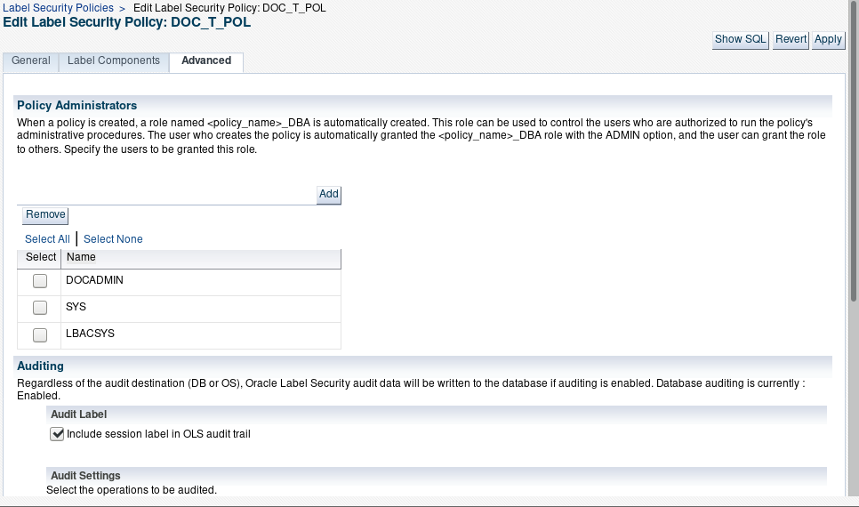
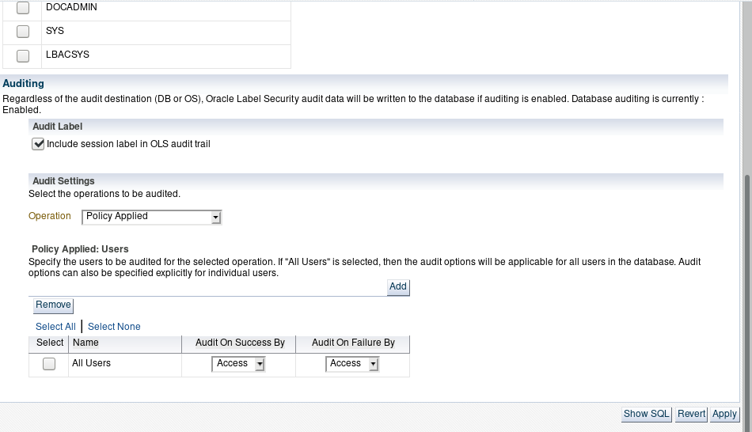

* 테이블 audit 결과 조회

```SQL
/*Create dedicated view to display audit record*/
EXEC sa_audit_admin.create_view(policy_name => 'doc_t_pol');
DESC dba_doc_t_pol_audit_trail
Name					   Null?    Type
----------------------------------------- -------- ----------------------------
USERNAME					    VARCHAR2(128)
USERHOST					    VARCHAR2(128)
TERMINAL					    VARCHAR2(255)
TIMESTAMP					    DATE
OWNER						    VARCHAR2(128)
OBJ_NAME					    VARCHAR2(128)
ACTION 				   NOT NULL NUMBER
ACTION_NAME					    VARCHAR2(47)
COMMENT_TEXT					    VARCHAR2(4000)
SESSIONID				   NOT NULL NUMBER
ENTRYID				   NOT NULL NUMBER
STATEMENTID				   NOT NULL NUMBER
RETURNCODE				   NOT NULL NUMBER
EXTENDED_TIMESTAMP				    TIMESTAMP(6) WITH TIME ZONE
DOC_T_LABEL					    VARCHAR2(4000)

select username, userhost, terminal, timestamp, obj_name, action_name, comment_text from dba_doc_t_pol_audit_trail;
USERNAME   USERHOST	   TERMINAL	   TIMESTAMP	      OBJ_NAME	      ACTION_NAME	   COMMENT_TEXT
---------- --------------- --------------- ------------------ --------------- -------------------- --------------------------------------------------
LBACSYS    woko-linux	   unknown	   09-MAR-20			      PRIVILEGED ACTION    DOC_T_POL: BYPASSALL PRIVILEGE SET

conn docuser/docuser

exec sa_session.set_access_profile(policy_name => 'doc_t_pol', user_name => 'U1202_01');
select doc_no,doc_creator,doc_type,doc_state, sign_org, label_to_char(doc_t_label) label, UTL_RAW.CAST_TO_VARCHAR2(content) as content from docadmin.doc_t;

conn lbacsys/Welcome1
set line 200
col username format a10
col userhost format a15
col terminal format a15
col obj_name format a15
col action_name format a20
col comment_text format a50
select username, userhost, terminal, timestamp, obj_name, action_name, comment_text from dba_doc_t_pol_audit_trail;
USERNAME   USERHOST	   TERMINAL	   TIMESTAMP	      OBJ_NAME	      ACTION_NAME	   COMMENT_TEXT
---------- --------------- --------------- ------------------ --------------- -------------------- ------------------------------
LBACSYS    woko-linux	   unknown	   09-MAR-20			      PRIVILEGED ACTION    DOC_T_POL: BYPASSALL PRIVILEGE
												    SET

DOCUSER    woko-linux	   pts/3	   09-MAR-20			      PRIVILEGED ACTION    DOC_T_POL: U1202_01: PROFILE_A
												   CCESS PRIVILEGE

```
이 것으로 Oracle Label Security에 대한 데모 예제를 마치겠습니다. 자세한 사용방법과 설명은 아래 OLS Admininstrator 가이드를 참고하십시오.

참고자료:
Oracle Label security Administrotor's Guide 19c. <https://docs.oracle.com/en/database/oracle/oracle-database/19/olsag/index.html>  
